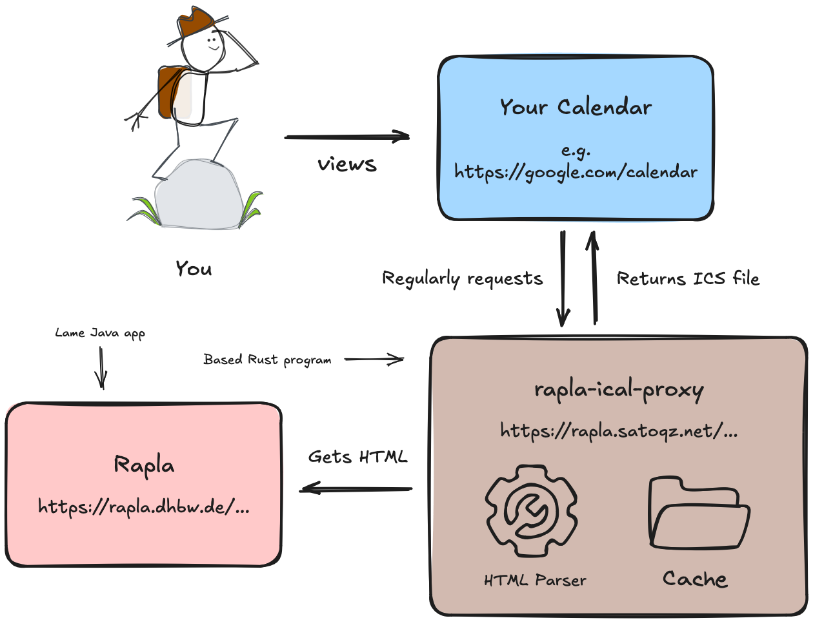

# rapla-ical-proxy

[](https://github.com/satoqz/rapla-ical-proxy/pkgs/container/rapla-ical-proxy)
[](https://github.com/satoqz/rapla-ical-proxy/actions/workflows/checks.yml)
[](https://github.com/satoqz/rapla-ical-proxy/deployments/production)

- [**Quickstart**](#quickstart)
- [**Architecture**](#architecture)
- [**Self-hosting**](#self-hosting)

**rapla-ical-proxy** proxies requests to the HTML-based class schedule page of DHBW to the iCalendar format such that it can be imported and continuously synced into proper calendar software such as Outlook, Google Calendar and lots of others.

If you are a dual student at DHBW looking to view your work schedule together with your class schedule in the same calendar app, this is the solution you're looking for.

## Quickstart

This shouldn't take you more than 5 minutes:

1. Get your rapla link ready. This should be a decently long URL starting with "https://rapla.dhbw.de/...".

2. Replace "dhbw.de" with "satoqz.net".

3. Paste the result into the "New calendar subscription" feature of your calendar app. The name of the feature may vary based on what app you're using.

Congratulations, you no longer need the HTML-based rapla calendar. The calendar subscription you just created will automatically stay in sync with any updates made to your schedule.

## Architecture



## Self-hosting

You can easily deploy the proxy yourself using the container image built by GitHub Actions. Both `linux/amd64` and `linux/arm64` platforms are supported.

```sh
docker run -p 8080:8080 ghcr.io/satoqz/rapla-ical-proxy
```

You can customize address/port configuration and caching behavior using command line flags. To list available options, run:

```sh
docker run ghcr.io/satoqz/rapla-ical-proxy --help
```
